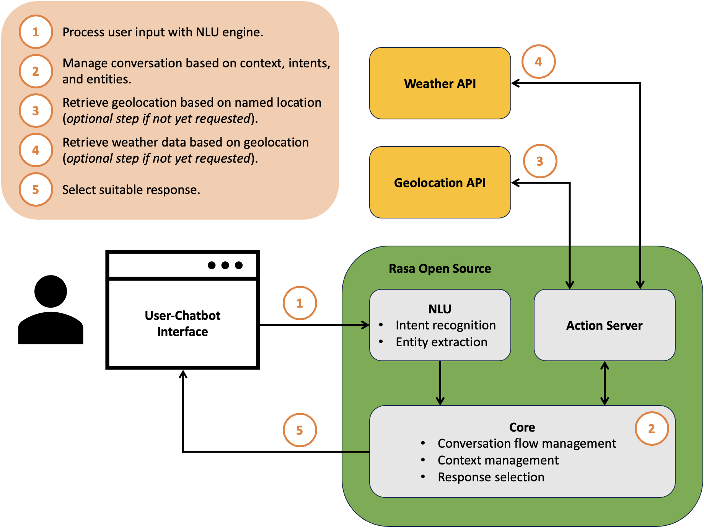

# Rasa Weather Chatbot

This project implements a weather forecast chatbot with [Rasa Open Source](https://rasa.com/docs/rasa/).

The chatbot enables users to request location-based weather information using natural language. Thereby, information like weather conditions, temperature, wind speed, etc. can be provided. User requests are answered with real weather data retrieved from [OpenWeather](https://openweathermap.org/api)'s GeoLocation and Weather APIs [(OpenWeather, 2023a; OpenWeather, 2023b; OpenWeather, 2023c)](#sources).

The following diagram illustrates the architecture and main components of the solution.



## Table of Contents
1. [Requirements](#requirements)
1. [Installation](#installation)
1. [Usage](#usage)
1. [Limitations](#limitations)
1. [Sources](#sources)
1. [License](#license)

## Requirements
This project requires **Python 3.9** or higher. Other dependencies are listed in [requirements.txt](./requirements.txt).

Moreover, an [OpenWeather](https://openweathermap.org/api) API key is required. The key can be obtained for free by creating an account on the website.

## Installation
To install the project, clone the repository and install the dependencies using pip.
```bash
git clone <this-repository>
cd rasa-weather-chatbot
pip install -r requirements.txt
```

Within `/rasa/actions` create a file named `config.py` for your OpenWeather API key.
```bash
cd rasa/actions
touch config.py
```

Add the following line to `config.py` and replace `<your-api-key>` with your OpenWeather API key.
```python
OPEN_WEATHER_API_KEY = "<your-api-key>"
```

## Usage
The chatbot can be trained and used via the [Rasa CLI](https://rasa.com/docs/rasa/command-line-interface).

Therefore, navigate to the `/rasa` directory.
```bash
cd rasa
```

Now, train the chatbot.
```bash
rasa train
```

Afterwards, start the action server to enable the chatbot to retrieve weather data from external APIs.
```bash
rasa run actions
```

Finally, open another terminal window within the `/rasa` directory and start the chatbot.
```bash
rasa shell
```

You can now interact with the chatbot using the shell interface.

> **Note**
> The Natural Language Understanding (NLU) component uses a lookup table to identify city names in user messages. The lookup table is defined in [cities.yml](./rasa/data/cities.yml) and was created by parsing the basic database from [simplemaps.com](https://simplemaps.com/data/world-cities) [(SimpleMaps, 2023)](#sources).

## Limitations
The following limitations apply to this project:
- The application is not designed for production use. It is intended to demonstrate the operating principles of a conversational AI.
- The chatbot only supports English language.
- The training data for the NLU component is limited. The chatbot can only handle a small set of wordings for specific requests.
- The interaction capabilities of the chatbot are limited. It is not able to handle complex requests or conversations.

## Sources
The following sources were used to create this project:
- OpenWeather. (2023a). *Geocoding API*. https://openweathermap.org/api/geocoding-api.
- OpenWeather. (2023b). *Current weather data*. https://openweathermap.org/current.
- OpenWeather. (2023c). *Daily forecast 16 days*. https://openweathermap.org/forecast16.
- SimpleMaps. (2023). *World Cities Database*. https://simplemaps.com/data/world-cities.

## License
This project is licensed under the terms of the [MIT license](./LICENSE).